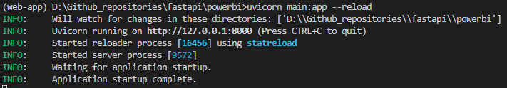
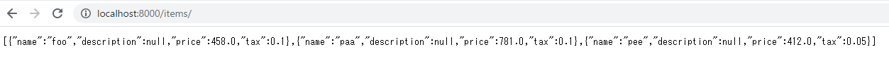
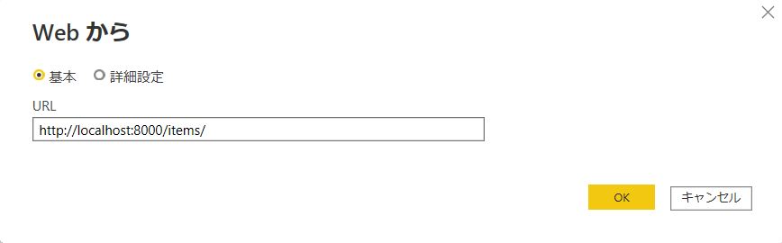
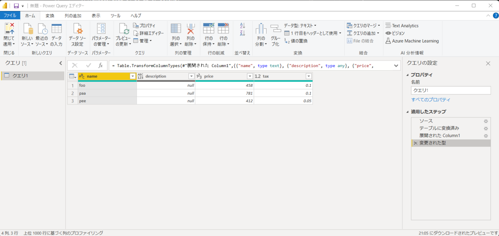

# FastAPIで作ったAPIをPowerBIからGETする方法

## モチベーション
* 任意のDBアクセスや機械学習、計算処理などをAPIにして、PowerBIからAPIをたたけば、ダッシュボードと複雑な計算処理を組み合わせることができ、色々なことがローコードで実現できるのではないか？というモチベーションで調べ始めた。

## サンプル作成の前提
* 開発者はPython環境、PowerBI環境をすでに入手していること。
* PowerBIからAPIサーバを介してデータにアクセスする。
* APIサーバーはFastAPIで作る。
<br>
※APIサーバーはFastAPIでなくても良いが、業務で使い始めた都合でここではFastAPIを使っている。

## OS・Python・ライブラリのバージョン情報
```bash
Windows 11
python==3.6.12
fastapi==0.75.0
uvicorn==0.16.0
pydantic==1.9.0
```

## FastAPIのコード
* 3レコードが保持されたDBにアクセスする例。

```python :main.py
from typing import Optional

from fastapi import FastAPI
from pydantic import BaseModel
from typing import List

class Item(BaseModel):
    name: str
    description: Optional[str] = None
    price: float
    tax: Optional[float] = None


app = FastAPI()


@app.get("/items/", response_model=List[Item])
async def get_item():
    item = [
        {
            "name": "foo",
            "description": None,
            "price": 458,
            "tax": 0.1,
        },
        {
            "name": "paa",
            "description": None,
            "price": 781,
            "tax": 0.1,
        },
        {
            "name": "pee",
            "description": None,
            "price": 412,
            "tax": 0.05,
        }
    ]
    return item
```

## Fast APIの実行
1. main.pyのあるディレクトリに移動。
2. ターミナルから以下を実行。
    ```
    uvicorn main:app --reload
    ```
3. こんな感じで起動すればOK。

    

4. 任意のブラウザから `localhost:8000/items` にアクセス。想定通りのデータが取得できることを確認。

    
    

## PowerBIでの接続手順
1. PowerBIを起動。
2. 「データを取得」⇒「Web」と選択。
3. 「URL」に`http://localhost:8000/items/`を貼り付けたら「OK」。
    

4. PowerQueryエディタが立ち上がり、自動でテーブルに変換してくれる。
    
5. ここまでできることを確認できたら、後は普段通りにPowerBIを操作していけばOK。

## 今後どんなことに活用してみたいか
* API内部に機械学習の学習処理、推論処理を入れて、PowerBIに結果を介して可視化する。
* ローカルでは処理に時間がかかる計算を高性能のAPIサーバーで計算させる。
* APIに認証を入れてDBへのアクセス権限を管理する（もはやPowerBI関係ない）。

## 今後の予定
* PowerBIからAPIへPOSTする方法を調べる。

## 参考文献・URL
* https://fastapi.tiangolo.com/
* https://junglejava.jp/archives/2016/07/entry_2528.html
